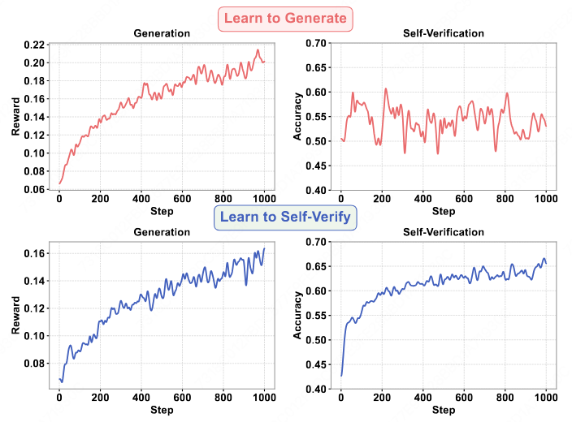
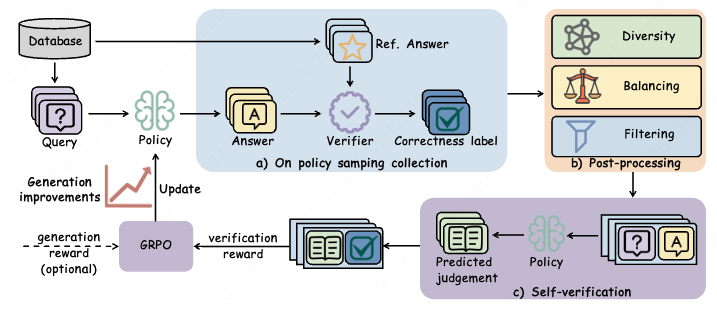
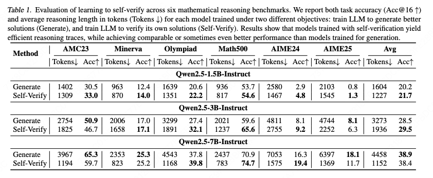
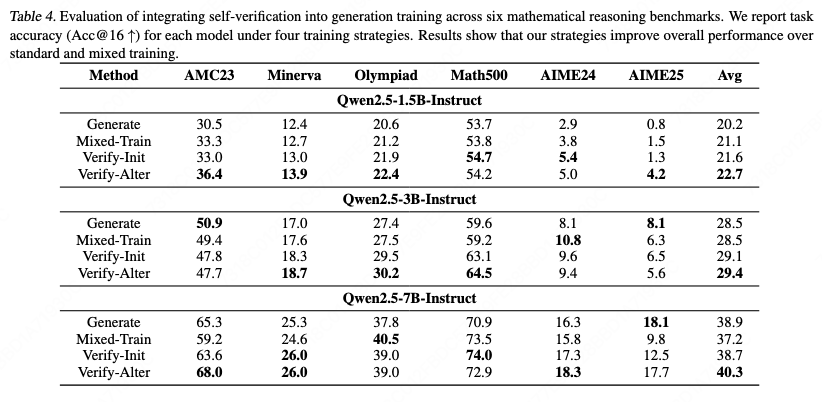

# Learning to Self-Verify Makes Language Models Better Reasoners

<p align="center">
  <a href="https://arxiv.org/abs/2602.07594"></a>
  <a href="https://github.com/chenyuxin1999/Learning-to-Self-Verify"></a>
  <a href="https://opensource.org/licenses/Apache-2.0"></a>
</p>

> ### News
> - **[2026-03]** Code and training scripts released!
> - **[2026-02]** Paper released on [arXiv](https://arxiv.org/abs/2602.07594)

## Overview

Recent LLMs achieve strong performance in generating promising reasoning paths for complex tasks. However, despite powerful generation ability, LLMs remain weak at verifying their own answers, revealing a **persistent capability asymmetry between generation and self-verification**.

We conduct an investigation of this asymmetry and discover a key finding:

- **Learning to generate does NOT improve self-verification ability**
- **Learning to self-verify CAN effectively improve generation performance**

<p align="center">
  
</p>


Building on this observation, we propose a **multi-task reinforcement learning framework** that integrates self-verification into generation training, where generation and self-verification are optimized as two independent but complementary objectives.


### Key Findings

1. **Asymmetry Discovery**: Improving a model's generation performance does not lead to corresponding improvements in its ability to verify its own solutions.

2. **Reverse Direction**: Training the model to self-verify improves its generation performance, achieving comparable performance to standard generation training.

3. **Efficiency Gains**: Models trained with self-verification show significant reduction in the number of tokens required to solve problems, indicating more efficient reasoning.

4. **Test-time Scaling**: Stronger self-verification unlocks effective test-time scaling through verification-guided majority voting.

## Method

### Self-Verification Training Pipeline

1. **On-policy Sampling**: Collect problem-solving trajectories from the model
2. **Post-processing**: Apply data balancing, filtering, and diversity-aware sampling
3. **Self-Verification Training**: Train the model to judge correctness of its own answers using GRPO

<p align="center">
  
</p>

Our framework consists of two main training strategies:

1. **Learning to Self-Verify as Initial Policy**: Train the model to verify correctness of its own solutions before generation training.

2. **Alternating Training**: Alternate between generation and verification phases, where a verification phase is triggered after several generation steps.


## Installation

### Prerequisites

- Python 3.10+
- NVIDIA GPU with CUDA support (CUDA 12.1+ recommended)
- Ray for distributed training

### 1. Create Conda Environment

```bash
conda create -n self-verify python=3.10 -y
conda activate self-verify
python -m pip install --upgrade pip
```

### 2. Install Dependencies

```bash
pip install -r requirements.txt
```

### 3. Install Flash Attention (Optional but Recommended)

```bash
pip install flash-attn --no-build-isolation
```

### 4. Install the Package

```bash
pip install -e .
```

## Training

### Data Preparation

Prepare your training data in parquet format with the following structure:

```
data/
├── train.parquet
└── test.parquet
```

Each entry should contain:
- `prompt`: The input question/problem
- `data_source`: Identifier for reward function selection

### Start Ray Cluster

**On the head node:**

```bash
ray stop --force
ray start --head \
  --port=8278 \
  --dashboard-host=0.0.0.0 \
  --dashboard-port=8265
```

**On worker nodes** (replace `<HEAD_IP>` with head node's IP):

```bash
ray stop --force
ray start --address="<HEAD_IP>:8278"
```

### Learning to Generate

Standard generation training using DAPO:

```bash
bash Learning_to_generate.sh
```

### Learning to Self-Verify

Train the model to verify correctness of its own solutions:

```bash
bash Learning_to_self_verify.sh
```

### Joint Training (Generation + Verification)

Alternate between generation and self-verification training:

```bash
bash Learning_to_self_verify_w_generation.sh
```


## Results

Learning to self-verify effectively improves generation performance, achieving comparable or even superior results across multiple benchmarks while using substantially fewer tokens.

<p align="center">
  
</p>


Integrating self-verification objectives into generation training consistently outperforms generation-only training across multiple benchmarks.

<p align="center">
  
</p>


*Note: Please refer to our paper for detailed experimental results and analysis.*


## Citation

If you find this work useful in your research, please consider citing:

```bibtex
@article{chen2026learning,
  title={Learning to Self-Verify Makes Language Models Better Reasoners},
  author={Chen, Yuxin and Wang, Yu and Zhang, Yi and Ye, Ziang and Cai, Zhengzhou and Shi, Yaorui and Gu, Qi and Su, Hui and Cai, Xunliang and Wang, Xiang and Zhang, An and Chua, Tat-Seng},
  journal={arXiv preprint arXiv:2602.07594},
  year={2026}
}
```

## Acknowledgements

This project builds upon several excellent open-source projects:

- **[veRL](https://github.com/volcengine/verl)** - Reinforcement learning training framework
- **[SGLang](https://github.com/sgl-project/sglang)** - Fast serving framework for LLMs
- **[vLLM](https://github.com/vllm-project/vllm)** - High-throughput LLM serving
- **[Qwen](https://github.com/QwenLM/Qwen)** - Base language models

## License

This project is licensed under the Apache License 2.0 - see the [LICENSE](./LICENSE) file for details.
